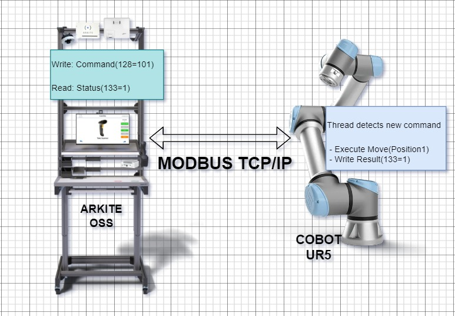
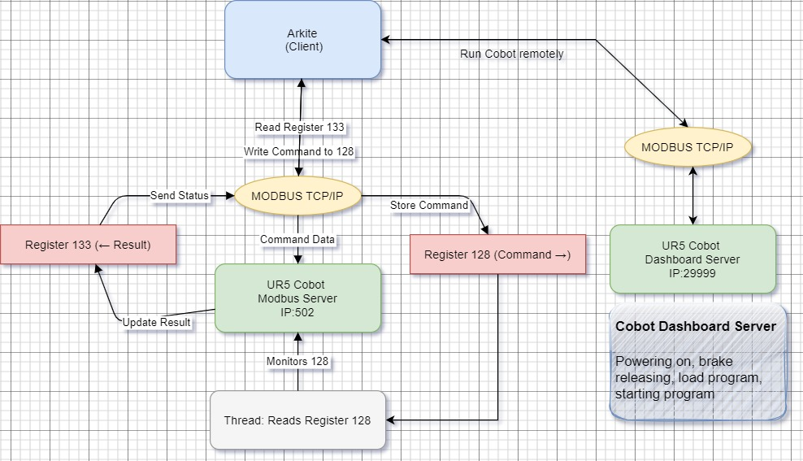
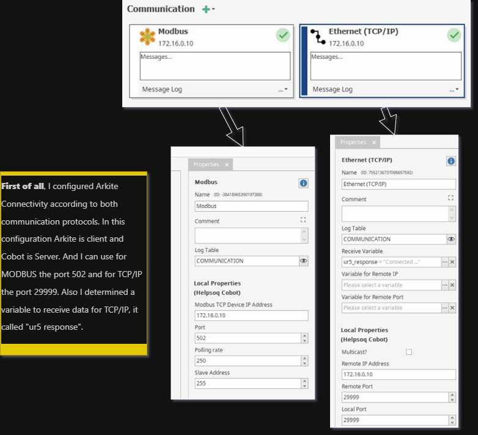

# Arkite Operator Guidance Platform with Cobot UR5 Robot
In this project, I attempted to connect the Arkite OSS to a Cobot robot within the same project. Both systems worked on the same project. I used MODBUS and TCP/IP communication protocols for this. The project consisted of simple steps for both systems. On the Arkite side, I used a projector and a screen to display digital instructions to the workers. The Cobot performed simple movements in various directions. Both systems communicated using MODBUS and TCP/IP protocols.
Working on two different platforms was truly enjoyable for me.

    

## Arkite’s Operator Guidance Platform
The Operator Guidance Platform from Arkite is a manufacturing-software + hardware system designed to support manual workstations in factories by using augmented reality (AR) and smart sensors. It essentially transforms a manual assembly or workbench area into a digital-interactive environment.
(https://arkite.com/)
## What Is the UR5 Cobot?

- The UR5 is a collaborative robot (Cobot) made by Universal Robots, a leading manufacturer of lightweight robot arms.
- Collaboration means it’s designed to work safely around humans: it has built-in force sensing and safety features. 
- It’s a 6-axis robot arm.

## What is the MODBUS TCP/IP?
MODBUS TCP/IP is a communication protocol used in industry to let machines, sensors, robots, PLCs, and software exchange data over an Ethernet network.

It is one of the most common and simplest industrial communication standards.

MODBUS TCP/IP = MODBUS protocol + TCP/IP network.

MODBUS → a very old and simple protocol where devices read and write data in registers.

TCP/IP → the standard internet/Ethernet network system.

So **MODBUS TCP/IP** means:

- ➡️ You send numerical values to a device (like a robot)
- ➡️ The device reads them from holding registers
- ➡️ The device also writes information back in other registers
- ➡️ All this happens over Ethernet (CAT5/CAT6 cable) using IP addresses.

**Working Schema Explanation: Arkite ↔ UR5 Cobot**

**1. System Overview:**
- **Arkite OSS (Operator Support System)**: Acts as the **MODBUS TCP Client**.
- **UR5 Cobot**: Acts as the **MODBUS TCP Server**.
- **Communication Protocol**: MODBUS TCP/IP over Ethernet.
- **Server adress** -> **Robot IP:502**
- **Dashboard server (Ethernet (TCP/IP))** -> **Robot IP:29999**

    

**2. Communication Flow for Dashboard Server:**

A Universal Robot can be controlled from remote by sending simple commands to the GUI over a TCP/IP socket. This interface is called the "Dashboard server". The server is running on port 29999 on the robots IP address. Each command should be terminated by a ‘\n’ also called a newline.

**The main functions of the Dashboard Server are:**

- **Load:** Load a robot program.
- **Play:** Start the execution of a robot program.
- **Pause:** Pause the execution of a robot program.
- **Stop:** Stop the execution of a robot program.
- **Set User Access Level:** Change the user access level.
- **Receive Feedback:** Receive feedback about the robot state.

**Command Transmission:**
- Connect to the dashboard server from IP:29999.
- Send command to the robot and wait response.

The sample communication python script is in the [ur-dashboard-script](./ur-dashboard-script) directory.

**3. Communication Flow for MODBUS Server:**

**Step 1 – Command Transmission:**
- The Arkite sends a **movement command** or **action request** to the UR5 robot.
- This command is written into the **holding register 128** on the UR5 server.
  - Example: `Register 128 = 101` (Move to Position 1)

**Step 2 – UR5 Execution:**
- The UR5 continuously runs a **thread** that monitors (reads) the value of **register 128**.
- When a new value is detected in register 128, the UR5 interprets it as a new command.
- The UR5 then performs the corresponding action, such as moving to a specified position.

**Step 3 – Result Feedback:**
- Once the action is completed, the UR5 updates **holding register 133** with a **status code or result**.
  - Example: `Register 133 = 1` → Action completed successfully.
  - Example: `Register 133 = 0` → Error or command not executed.

**Step 4 – Arkite Status Check:**
- The Arkite OOS reads **register 133** to verify the result of the previous command.
- Based on the value in register 133, the Arkite may:
  - Continue to the next instruction.
  - Retry the command.
  - Display a message to the operator.

**3. Summary of Register Usage:**
| Device | Role  | Register | Direction | Purpose |
|---------|-------|-----------|------------|----------|
| Arkite OOS | Client | 128 | Write → UR5 | Command request |
| UR5 Cobot | Server | 133 | Read ← Arkite | Execution result |

**4. Thread Behavior (UR5):**
- The UR5 runs a background thread that:
  1. Periodically polls register 128.
  2. Detects changes in value (new commands).
  3. Executes corresponding robot motions.
  4. Writes back the completion or status to register 133.

**5. Optional Enhancements:**
- Add additional registers for:
  - Error codes
  - Real-time position feedback
  - Command queueing
- Use proper synchronization in the UR5 thread to prevent data race.

---

# Application : Arkite project and Cobot programming

## 1- Arkite Project with MODBUS and TCP/IP

First of all, I configured Arkite Connectivity according to both communication protocols. The configurations here:

